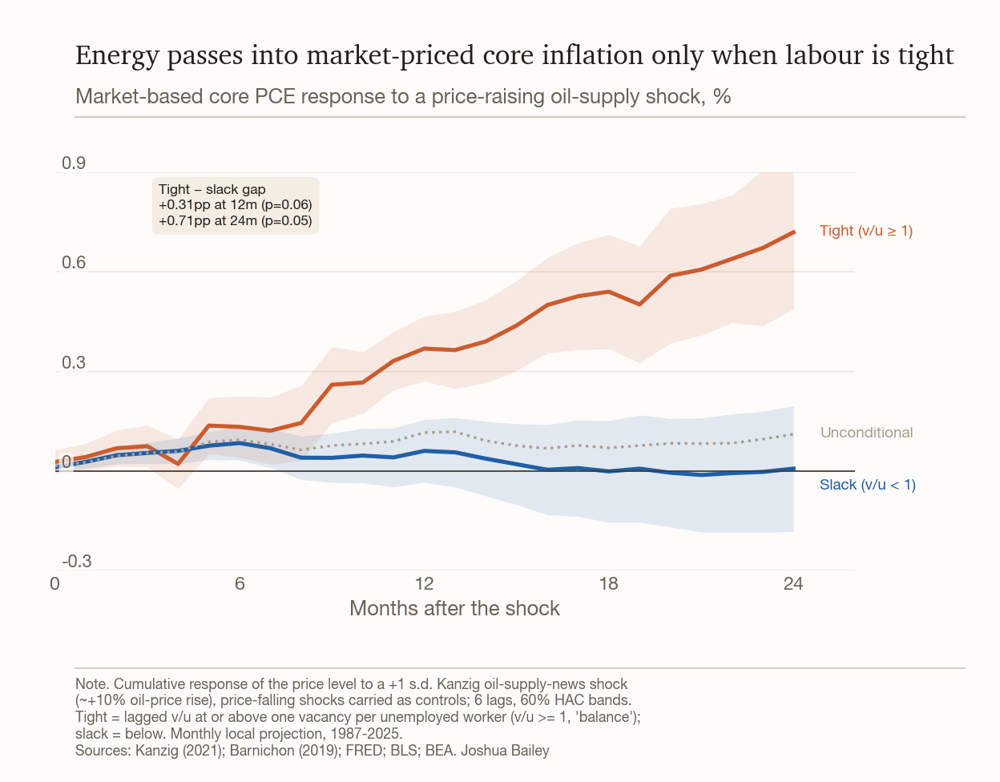

# When do oil-supply shocks raise underlying inflation? The role of labour-market tightness

**Abstract.** How does underlying inflation respond to an exogenous oil-supply shock, and does the response depend on the state of the labour market? We estimate the cumulative passthrough of Känzig's (2021) oil supply news shock into underlying inflation, using the shock as an observed exogenous regressor in state-dependent local projections (Ramey-Zubairy 2018) split by labour-market tightness. Unconditionally, the passthrough is close to zero. Splitting the sample at the balance point of one vacancy per unemployed worker (v/u = 1), a price-raising shock raises market-based core PCE by 0.71 percentage points more in a tight labour market than in a slack one at two years (p = 0.05). The effect reduces monotonically as the measure of inflation includes more administered prices. A second, independent channel runs through shock size. Because the passthrough is conditional on labour-market tightness, an oil-supply shock that hits an economy while the labour market is at balance, as in 2026, feeds into underlying inflation far less than the same shock would in an overheating one, suggesting central banks can safely “look through” the shock.



## Motivation and question

Headline inflation tracks oil prices almost mechanically, through the energy component of the basket. The question that matters for policy-makers is what an oil shock does to *underlying* inflation, the persistent component a central bank targets once the direct effects pass through. Standard practice treats that passthrough as a stable, roughly linear coefficient. We ask whether it is instead conditional on the state of the labour market.

The hypothesis is a slanted-L, or nonlinear-Phillips-curve, mechanism, and it has a standard New Keynesian basis. Firms set prices as a markup over marginal cost, so a cost shock passes through more fully when demand is strong and raising prices costs few sales; a tight labour market also lifts wage growth, adding a second-round cost increase through the wage-price channel. Both forces make passthrough larger when the labour market is tight and smaller when it is slack, where the shock is absorbed in margins instead. 

## Identification

The shock is Känzig's (2021) oil supply news shock: OPEC-announcement surprises, extracted from a structural VAR, published as a dense monthly series (1975-2025, 2025M12 vintage). It enters the local projections as an observed, exogenous regressor, in the Ramey-Zubairy (2018) tradition, not as an external instrument in an LP-IV. This is deliberate: combining an external instrument with regime weighting can manufacture spurious interaction terms even when there is no true state-dependence (Gonçalves, Herrera, Kilian & Pesavento, *JoE* 2024). The observed-shock design avoids that.

The shock is supply-side and verified orthogonal to the US labour-market state: a regression of the shock on six lags of the vacancy/unemployment ratio gives F ≈ 1.1, p ≈ 0.38, so interacting it with the demand state is not tautological. A pipeline unit test confirms a +1 s.d. shock raises WTI by roughly 14% and headline CPI by about 0.6pp, matching Känzig's normalisation.

## Method

Observed-shock state-dependent local projections (Ramey-Zubairy 2018): the cumulative price-level response over horizons 0-24 months, with every regressor interacted with a tight/slack regime weight. The headline specification isolates the price-raising half of the shock (oil-price-up = supply-reducing, the relevant direction for a geopolitical oil shock): the shock is split at zero, the price-raising part is interacted with the regime, and the price-falling part is carried as a control (`state_sign_lp` in `svar_lp_utils.py`). The headline regime is a hard threshold at v/u = 1, one vacancy per unemployed worker, the point of labour-market balance; a smooth logistic transition in the same ratio is run as a robustness check. The state enters the model lagged, F(z_{t−1}), so the regime is predetermined.

Inference uses Newey-West HAC standard errors with bandwidth h+1, which absorb the serial correlation that overlapping projection windows induce. The projections are also lag-augmented, the construction Montiel-Olea & Plagborg-Møller (2021) show delivers valid, robust local-projection inference. A wild bootstrap (deterministic seed) is reported as a cross-check. The headline test is a Wald test of H0: β_hot = β_slack by horizon.

## Sample

Each gauge is estimated over its own available sample, all ending in 2025: core PCE from 1975, CPI supercore from 1983 (when owners' equivalent rent was introduced), market-based core PCE from 1987. We extend the JOLTS series (which starts in 2000) with the long v/u data from Barnichon's composite Help-Wanted Index, rescaled to JOLTS units (correlation 0.9999 during the overlapping period).

## Results

Results are the hot-minus-slack passthrough gap in percentage points (pp), per +1 s.d. shock, at the 12- and 24-month horizons.

### The main result: market-based core PCE

Market-based core PCE strips out the imputed and non-market prices in the PCE deflator—financial services priced without payment, non-profit consumption, insurance imputations—leaving prices actually transacted. Splitting at v/u = 1, a price-raising shock (about +10% crude) opens a hot-minus-slack gap of 0.31pp at 12 months (p = 0.056), widening to 0.71pp at 24 months (p = 0.047). Unconditionally the same passthrough is 0.12pp, indistinguishable from zero: the labour-market split does the work. Because the tight regime is v/u ≥ 1, today's labour market (v/u ≈ 0.95, just below balance) sits on the slack, near-zero path.

### Robust across specifications

The result holds three ways. First, the smooth logistic split of the same ratio gives a larger gap, 0.67pp at 12 months (p = 0.005) and 1.35pp at 24 months (p = 0.006), and — unlike the hard-cut headline — it survives dropping 2021-22 (1.11pp, p = 0.04). The strict v/u ≥ 1 cut carves out a thin, mostly post-2018 hot regime, so the headline 0.71pp itself falls to 0.19pp (p = 0.72) once 2021-22 is excluded; the robustness to that episode comes from the smooth split, not the hard cut. Second, it is not a property of this one series: the same tightness split works across market-priced inflation gauges (see the “ladder” table below). Third, it is robust to changing the tightness measure—the labour-quantity gauges separate the regimes, while wage growth and inflation expectations do not (see "which slack matters" below).

### More administered prices, smaller passthrough

The passthrough scales with how market-priced the gauge is. On a common 1987-onwards sample, the 12-month gap (smooth split, on which the cross-measure comparison is cleanest) falls monotonically as administered and imputed prices are added back:

| Gauge | 12-month gap (logistic split) | p |
|---|---|---|
| CPI supercore, ex-medical | 1.35pp | 0.01 |
| CPI supercore | 1.06pp | 0.04 |
| Market-based core PCE | 0.67pp | 0.005 |
| Headline core PCE | 0.47pp | 0.07 |

Headline core PCE, the most administered measure, carrying imputed medical, financial and non-profit prices, sits at the bottom: marginal on this common sample and insignificant on the full 1975-2025 sample. The consumer-priced CPI gauges run larger than the PCE ones, and stripping administered medical from CPI supercore lifts the gap further still. That ordering is the point. A genuine market-price passthrough acts on prices firms actually set, so diluting the gauge with administered prices dilutes the signal; the near-zero in headline core PCE is the endpoint of the mechanism, not evidence against it.

A note on basis: this ladder is estimated on the smooth logistic split, not the v/u = 1 headline. The hard cut is too coarse to compare gauges — under it the CPI measures lose significance and the ordering breaks down — so the smooth split, which uses the full continuous variation in tightness, is the more powerful basis for a cross-measure comparison. The monotonic ordering is a structural feature of how market-priced each gauge is; it is corroborating evidence for the mechanism rather than a v/u = 1 result.

### Secondary findings

- **The effect is linear in tightness.** A continuous-interaction projection finds the shock×tightness term significant at the 12- and 24-month horizons (p = 0.01 and 0.04) and the joint state-dependence test significant at every horizon, while the shock×tightness² term is indistinguishable from zero (p > 0.6): passthrough rises about linearly with tightness. One caveat: 2022 tightness (z ≈ +3.4) sits beyond the estimable range, so convexity that binds only at extreme tightness cannot be ruled out.
- **What kind of labour-market slack matters.** We defined the tight and slack regimes in several ways to see which captures the effect. The quantity measures produce our theorised result: splitting on the vacancy-to-unemployment ratio, or on the unemployment gap (unemployment relative to its estimated natural rate), cleanly separates high- from low-passthrough regimes. Splitting instead on wage growth (measured against its own recent trend), or on inflation expectations, does not — those regimes show no significant difference. The likely reason is that the operative variable is the scarcity of workers itself: when vacancies outnumber the unemployed, firms compete for labour and have the pricing and bargaining conditions to pass a cost shock through. Wage growth and expectations are downstream, and lagging, symptoms of that scarcity, so they are noisier ways to date the regime than counting the jobs and workers directly.
- **Big shocks pass through more, whatever the labour market.** Passthrough does not depend on the sign of the shock — price-raising and price-falling shocks behave symmetrically (p ≈ 0.2-1.0) — but it does depend on size: a larger oil shock passes through proportionally more than a small one (p ≈ 0.02 at 24 months), echoing Cavallo, Lippi and Miyahara's finding that firms reprice faster after big shocks. This is a second amplifier that works independently of tightness: when size and tightness are entered together, each stays significant (tightness p ≈ 0.004, size p ≈ 0.016 at 24 months). It matters because the two channels compound. A large enough oil shock can pass through even into a slacker labour market, and 2021-22 combined both a very tight labour market and unusually large shocks, which is part of why inflation ran as hot as it did.

## Discussion

A clean oil-supply shock feeds into underlying inflation only when the labour market is tight, and only in prices that are actually transacted. On market-based core PCE, split at the balance point of v/u = 1, the tight-minus-slack gap is 0.71pp at two years; the effect strengthens through the more consumer-priced CPI measures and fades in the administered-heavy core PCE deflator. That monotonic ordering, rather than any single coefficient, is the evidence that this is genuine market-price passthrough. A second channel, shock size, operates alongside the tightness one.

The conditioning is what matters for the outlook. Because passthrough depends on labour-market tightness, the same oil shock does very different things depending on where the labour market sits. Today it sits at v/u ≈ 0.95, just below balance and far from the 2021-22 extreme. An oil shock hitting an economy with that much slack should show up in energy prices and fade, rather than driving the second-round inflation it would in an overheating economy. For policy-makers, that is the case for looking through it.

## Regime definitions

The main results use the hard v/u = 1 threshold and are the **top-level** charts in each measure folder; the logistic robustness cross-check lives in a **`robustness_logistic/`** sub-folder alongside them.

- **v/u = 1 (top level), the headline estimator**: a hard threshold at one vacancy per unemployed worker (v/u ≥ 1 = tight, below = slack).
- **`robustness_logistic/`, the robustness cross-check**: a smooth logistic transition in the same ratio, centred on its sample mean (γ = 1.5).

## Data and sources

All inputs are public. Nothing comes from a subscription service.

| Series (role) | Public source |
|---|---|
| Oil supply news shock (the shock) | Känzig (2021), `github.com/dkaenzig/oilsupplynews`, 2025M12 vintage |
| CPI supercore (CPI dependent) | **Constructed** from official BLS component indexes (`CUSR0000SASLE` services less energy, `SEHA` rent, `SEHC` OER) and BLS relative-importance weights, by the standard CPI aggregation (`build_public_cache.py`). Not published as a single series. |
| CPI airfares / transport svcs / medical svcs / lodging (components) | BLS via FRED: `CUSR0000SETG01` / `SAS4` / `SAM2` / `SEHB` |
| CPI recreation svcs / education-and-comm svcs (components) | BLS flat-file server (`download.bls.gov`): `CUSR0000SARS` / `SAES` (national SA, not carried on FRED) |
| CPI relative-importance weights | **Built** from the official BLS December relative-importance tables (bls.gov), carried forward month to month by NSA-index drift |
| Core PCE price index (PCE dependent) | FRED `PCEPILFE` |
| Market-based core PCE (PCE dependent) | FRED `DPCXRG3M086SBEA` |
| PCE core services ex housing (robustness input) | FRED `IA001260M` |
| Labour market, energy, expectations (states + controls) | FRED (`data_cache/fred_macro.csv`) |
| Long v/u composite | Barnichon (2019) Help-Wanted Index, `github.com/letsgoexploring/economic-data` |
| Supply/demand-driven PCE decomposition (a state) | Shapiro (2024), San Francisco Fed |

The committed `data_cache/` holds all of these as CSVs, so the analysis runs offline with no API key. `build_public_cache.py` regenerates the CPI/PCE inputs from FRED + BLS; it needs a free `FRED_API_KEY` (and, for the BLS relative-importance tables, an optional `BLS_CONTACT_EMAIL` in the User-Agent, which BLS asks for). The CPI supercore is built by the standard CPI aggregation and reproduces it to rounding (growth-rate correlation 0.9997 against the official BLS component indexes and relative-importance weights). The main result, market-based core PCE, comes straight from FRED and needs no construction.

## Repository layout

```
analysis.ipynb          Main notebook: data, diagnostics, state-dependent LPs, all figures.
svar_lp_utils.py        LP estimators (state-dependent, sign-split, continuous-interaction,
                        asymmetry; lag-augmented HAC + wild bootstrap).
regime_comparison.py    Regenerates the regime-sensitive charts (state-dependent IRF, robustness panel,
                        two-paradigms) from data_cache: the v/u=1 main at the folder top level and the
                        logistic robustness in each robustness_logistic/ subfolder.
build_public_cache.py   Rebuilds the CPI/PCE data_cache inputs from public sources (FRED + BLS).
shared/                 Vendored chart-style and FRED helpers (self-contained; no external install).
data_cache/             All input data as CSVs (public sources; runs offline).
cpi_supercore/          CPI supercore outputs (main v/u=1 charts + robustness_logistic/).
pce_core/               Core-PCE outputs (headline core PCE gauge; ex-housing series is a robustness input).
pce_market_based/       Market-based core PCE outputs (the main gauge).
```

Each measure folder holds, at the **top level**, the main (v/u=1) state-dependent IRF, robustness panel and two-paradigms IRF, plus the cross-measure and regime-independent figures (component attribution, passthrough curve, market-price ladder, paradigm map). The logistic robustness versions of the regime-sensitive charts sit in a **`robustness_logistic/`** subfolder.

## Reproducing

```bash
python3 -m venv .venv && source .venv/bin/activate
pip install -r requirements.txt

# Regenerate the regime-sensitive artifacts (no API key needed; runs from data_cache/):
python regime_comparison.py

# Re-run the whole notebook end to end:
jupyter nbconvert --to notebook --execute --ExecutePreprocessor.timeout=900 \
  analysis.ipynb --output analysis.ipynb

# Optional: refresh the CPI/PCE inputs from public sources (needs a free FRED_API_KEY in .env):
python build_public_cache.py
```

Run scripts from the repository root (paths are relative to it).

## References

- Barnichon, R. (2019). Building a composite Help-Wanted Index. *Economics Letters*.
- Cavallo, A., Lippi, F. & Miyahara, K. Large shocks travel fast (size-dependent passthrough).
- Gonçalves, S., Herrera, A. M., Kilian, L. & Pesavento, E. (2024). When and why do state-dependent local projections work? *Journal of Econometrics*.
- Känzig, D. R. (2021). The macroeconomic effects of oil supply news. *American Economic Review*.
- Montiel-Olea, J. L. & Plagborg-Møller, M. (2021). Local projection inference is simpler and more robust than you think. *Econometrica*.
- Ramey, V. A. & Zubairy, S. (2018). Government spending multipliers in good times and in bad. *Journal of Political Economy*.
- Shapiro, A. H. (2024). Decomposing supply- and demand-driven inflation. San Francisco Fed.

---

*Analysis by Joshua Bailey.*
